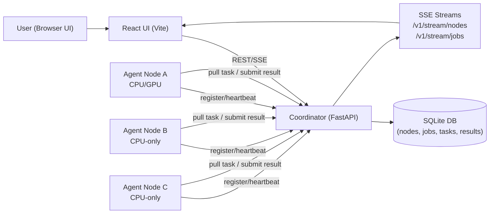
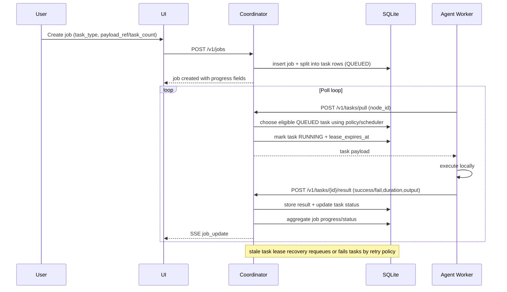

# EdgeMesh Architecture (Phase 1.5)

This document maps the system from job submission to distributed task completion across trusted LAN nodes.

## System Topology

## Execution Flow

## Key Modules

- `coordinator/app/coordinator_service/main.py`
: app startup, router wiring, background monitors.
- `coordinator/db/repository.py`
: persistence, scheduling-aware task pull, result aggregation, retries, metrics.
- `coordinator/api/routers/tasks.py`
: pull-based execution endpoints.
- `coordinator/api/routers/jobs.py`
: job creation, task splitting, task listing, progress publication.
- `coordinator/api/routers/stream.py`
: node/job SSE streams.
- `agent/src/agent_service/main.py`
: register + heartbeat + worker loop (pull/execute/report).
- `ui/src/pages/DevicesPage.tsx`
: live node status/policy controls.
- `ui/src/pages/JobsPage.tsx`
: job progress + task-level visibility.

## Security Boundaries

- Agent ingress endpoints require `X-EdgeMesh-Secret` when `EDGE_MESH_SHARED_SECRET` is configured.
- UI APIs are intentionally unauthenticated for local/LAN MVP usage.
- Trusted-network assumption: Phase 1.5 targets private LAN mesh.
